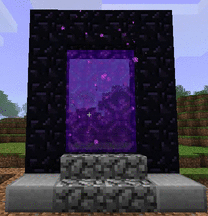

lo---
marp: true
theme: gaia
class: invert
paginate: true
---

# ⛏️ Misión 01: El Nether
### Nivel de Dificultad: Survival

---

## 📖 RETO: LECTURA VELOZ
*Lee antes de que se agote el tiempo:*

  "UN GHAST ESTÁ SOBREVOLANDO EL LAGO DE LAVA. SI LOGRAS LEER ESTAS LÍNEAS SIN EQUIVOCARTE, PODRÁS ACTIVAR TU ESCUDO Y REFLEJAR SUS BOLAS DE FUEGO. ¡DATE PRISA, EL PORTAL DE REGRESO SE ESTÁ CERRANDO!"

00.00s
<button onclick="window.startTime = performance.now(); window.timerInterval = setInterval(() => { document.getElementById('reloj').innerText = ((performance.now() - window.startTime)/1000).toFixed(2) + 's'; }, 10)">[ INICIAR ]</button>
<button onclick="clearInterval(window.timerInterval)">[ DETENER ]</button>

---

## ✍️ RETO: DICTADO
*Escribe en tu cuaderno lo que Papá te indique:*

**Instrucción de Dictado:**
*(Notas para Papá: "Para sobrevivir en el Nether, es obligatorio llevar al menos una pieza de armadura de oro para que los Piglins no te ataquen.")*

---

## 🧠 RETO: COMPRENSIÓN
*¿Qué pasa si intentas dormir en una cama en el Nether?*

 

<button onclick="document.getElementById('res').innerText='❌ ¡BOOM! LA CAMA EXPLOTA.'; document.getElementById('res').style.color='#ff5555'">A) EXPOLOTA</button>

<button onclick="document.getElementById('res').innerText='❌ NO, ESO ES EN EL OVERWORLD.'; document.getElementById('res').style.color='#ff5555'">B) TE DUERMES</button>

<button onclick="document.getElementById('res').innerText='💎 ¡CORRECTO! +1000 XP'; document.getElementById('res').style.color='#55ff55'">C) EXPLOTA</button>

---

---

# 🏆 FIN DE LA SESIÓN
### RESULTADOS PARA EL CSV:

* **Velocidad:** Ver tiempo en Slide 2.
* **Dictado:** Evaluar ortografía (Oro, Nether, Piglins).
* **Comprensión:** ¿Cazó el error de ortografía en la opción A?

---

### Ajustes finales importantes:
1.  **YAML:** Asegúrate de que el comando de Docker en tu `.github/workflows/deploy.yml` sea exactamente:
    `marpteam/marp-cli index.md --html -o index.html`
2.  **Imágenes:** He usado GIFs y PNGs directos de la Wiki de Minecraft para que se vea más real.
3.  **Ortografía:** En el Quiz puse "Expolota" en la A y "Explota" en la C. Es un buen truco para su comprensión lectora ver si nota la diferencia antes de elegir.

¿Te gustaría que te ayude con el siguiente tema de "Monstruos Marinos" usando este mismo estilo de fuentes y botones pero con colores azules? Sería genial para armar tu carpeta de `/temas`.
